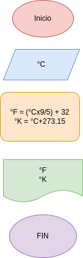

# convertir_-de_-temperatura
programa de python para convertir de kelvin a farenheit 

## Analisis 

### Variable de entrada 
- °c = Grados  celcius 

### Procesamieto 
°F = grados fahrenheit

°K = grados Kelvin

- °F = (°C x 9/5) + 32
- °K = °C + 273.15

## Diseño 

## Construcciones 
- codigo implementado en el archivo convertor_de_temperatura.py
